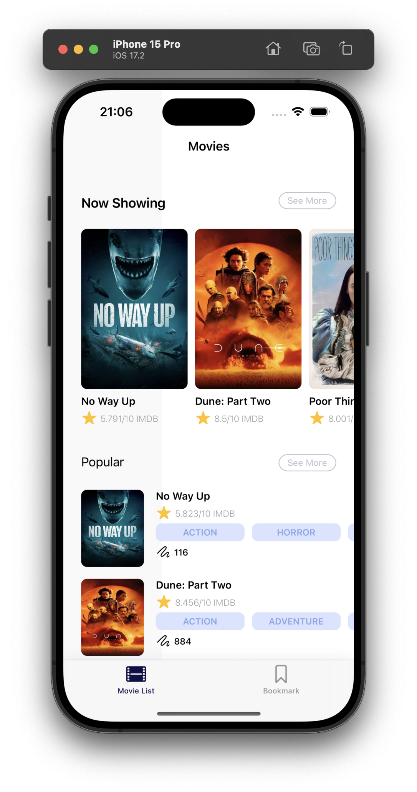
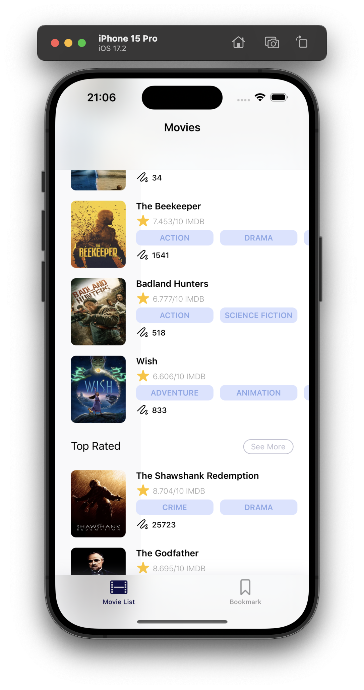
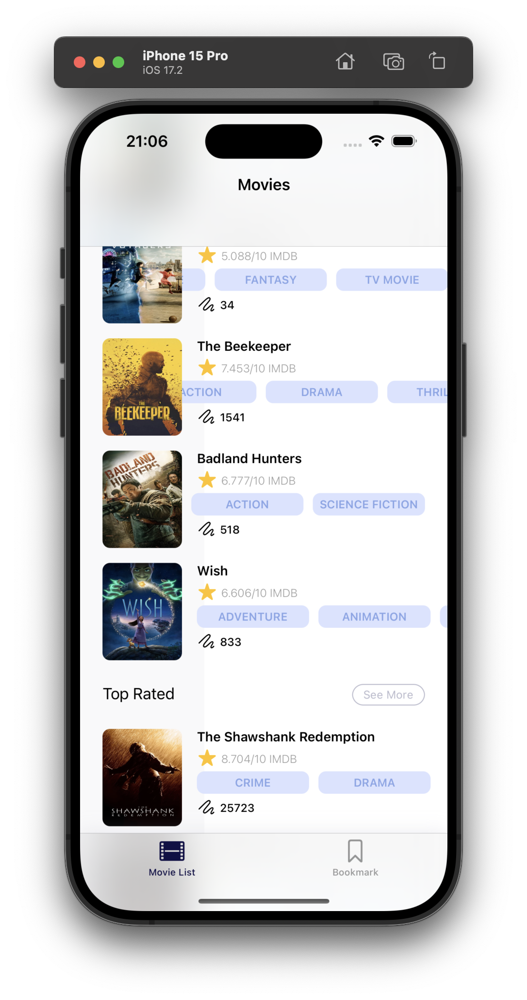
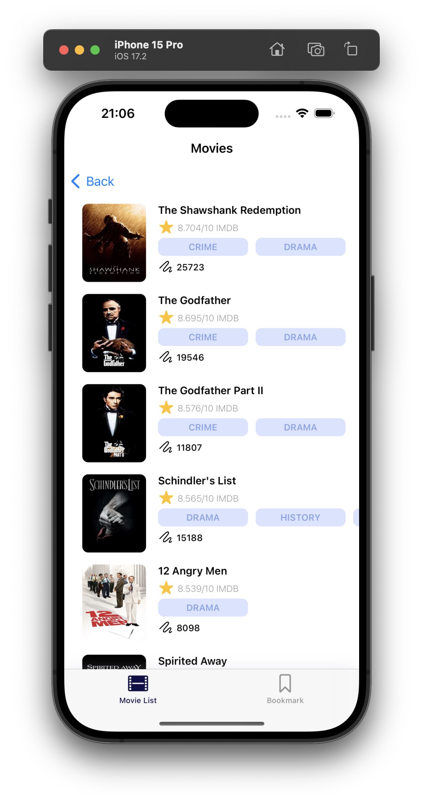

# Movie-App

This app was created as many pages. Tn the first page "themoviedb.org " movies withdrawn from the address are listed. On the second page, the details of these movies, various features are shown.

### Keywords

<ul>
    <li>MVVM</li>
    <li>Object Oriented Programming</li>
    <li>Protocol Oriented Programming</li>
    <li>Pagination</li>
    <li>GenericNetworkLayer</li>
    <li>GenericStorageManager</li>
    <li>URLSession</li>
    <li>UIKIT</li>
    <li>TableView</li>
    <li>CollectionView</li>
    <li>Codable</li>
    <li>Spm</li>
    <li>KingFisher</li>
    <li>Realm</li>
</ul>

| Home Screnn | Home Screen |
| --------------- | --------------- |
|   |   |

| Home Screen | Detail Screen |
| --------------- | --------------- |
|   |   |

| SeeMore Screen | SeeMore Screen |
| --------------- | --------------- |
|   |   |

